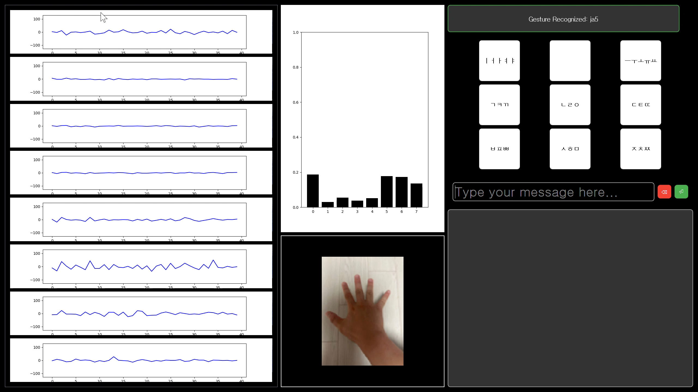
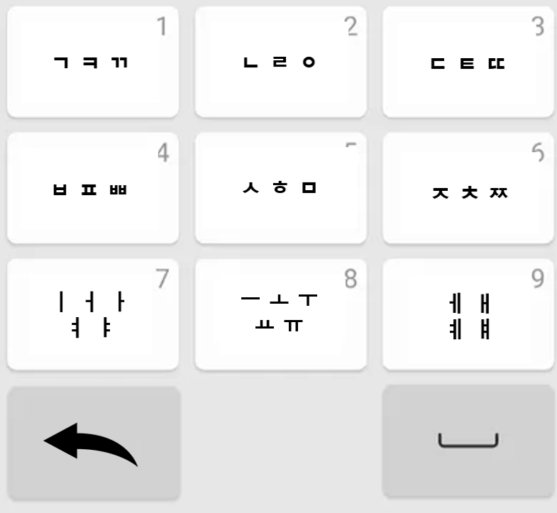

# Myo-armband keyboard

- - -

## Description
This project implements a real-time gesture recognition system using the Myo Armband EMG sensor, a TensorFlow-trained CNN model, and a PyQt5-based user interface. The system detects hand gestures and maps them to Korean characters (consonants and vowels), enabling interaction with the UI and keyboard simulation using PyAutoGUI.



- - -

## Features  
- **Real-Time EMG Signal Processing**: Captures raw EMG signals from the Myo Armband and processes them into RMS values.  
- **Hand Gesture Recognition**: Classifies gestures using a pre-trained **CNN (Convolutional Neural Network)** model.  
- **PyQt5-Based UI**: Displays EMG data, recognized gestures, and a virtual keyboard for interaction.  
- **Keyboard Input Simulation**: Dynamically types or deletes Korean characters using PyAutoGUI based on detected gestures.  
- **Dynamic Character Transition**: Supports character cycling (e.g., ㄱ → ㅋ → ㄲ) for Korean input.  
- **Customizable Gesture Mapping**: Easily modify gesture-to-character or key mappings.  
- **Interactive Visualization**: Displays real-time graphs of EMG signals and RMS values for debugging and monitoring.  

- - -

## File Structure
project-root/
│
├── main/
│   ├── cnn.ipynb
│   ├── cnn_model.h5
│   ├── scaler.pkl
│   ├── gest_cnn_opt_gui.py
│   ├── get_rms_textfile.py
├── data/
│   ├── rms.txt
│   ├── cnn1_ja.txt
│   ├── cnn1_mo.txt
│   └── ...  
├── assets/                
│   ├── ja1.png
│   ├── mo1.png
│   └── ...                
└── README.md

- - -

## Usage  
1. **Collect EMG Data**  
   - Run `get_rms_textfile.py` to record EMG data.  
     ```bash
     python main/get_rms_textfile.py
     ```  
   - Data is saved to `data/rms.txt`.  

2. **Organize Data**  
   - Move `rms.txt` data to gesture files (e.g., `cnn1_ja.txt`).  

3. **Train the Model**  
   - Use `cnn.ipynb` to train the CNN model and generate `cnn_model.h5` and `scaler.pkl`.  
     ```bash
     jupyter notebook main/cnn.ipynb
     ```

4. **Run the UI**  
   - Launch `gest_cnn_opt_gui.py` for real-time gesture recognition.  
     ```bash
     python main/gest_cnn_opt_gui.py
     ```

## Gesture to Character Mapping  

| **Gesture** | **Mapped Characters**           |
|-------------|---------------------------------|
| `ja1`       | ㄱ → ㅋ → ㄲ                    |
| `ja2`       | ㄴ → ㄹ → ㅇ                    |
| `ja3`       | ㄷ → ㅌ → ㄸ                    |
| `ja4`       | ㅂ → ㅍ → ㅃ                    |
| `ja5`       | ㅅ → ㅎ → ㅁ                    |
| `ja6`       | ㅈ → ㅊ → ㅉ                    |
| `mo1`       | ㅣ → ㅓ → ㅏ → ㅕ → ㅑ          |
| `mo2`       | ㅡ → ㅗ → ㅜ → ㅠ → ㅛ          |
| `mo3`       | ㅔ → ㅐ → ㅖ → ㅒ               |
| `back`      | Deletes the last character      |
| `space`     | Adds a space                    |
| `neutral`   | neutral                         |

**Note**: A **neutral gesture** is required between final consonants (종성) and initial consonants (초성) for proper recognition.




- - -